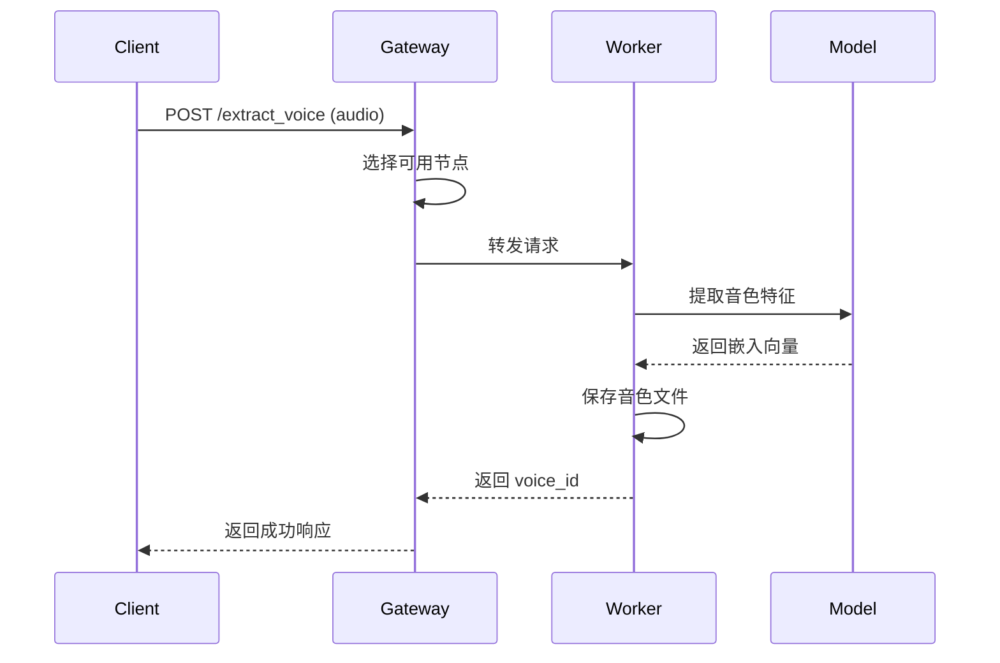
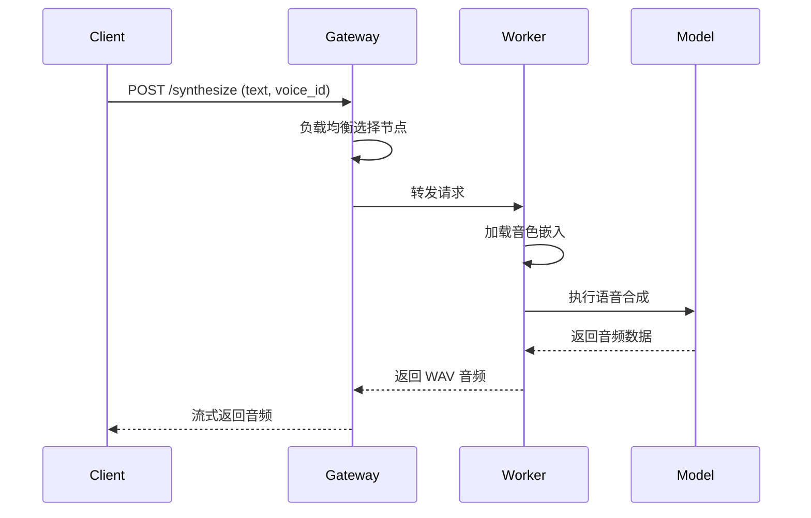
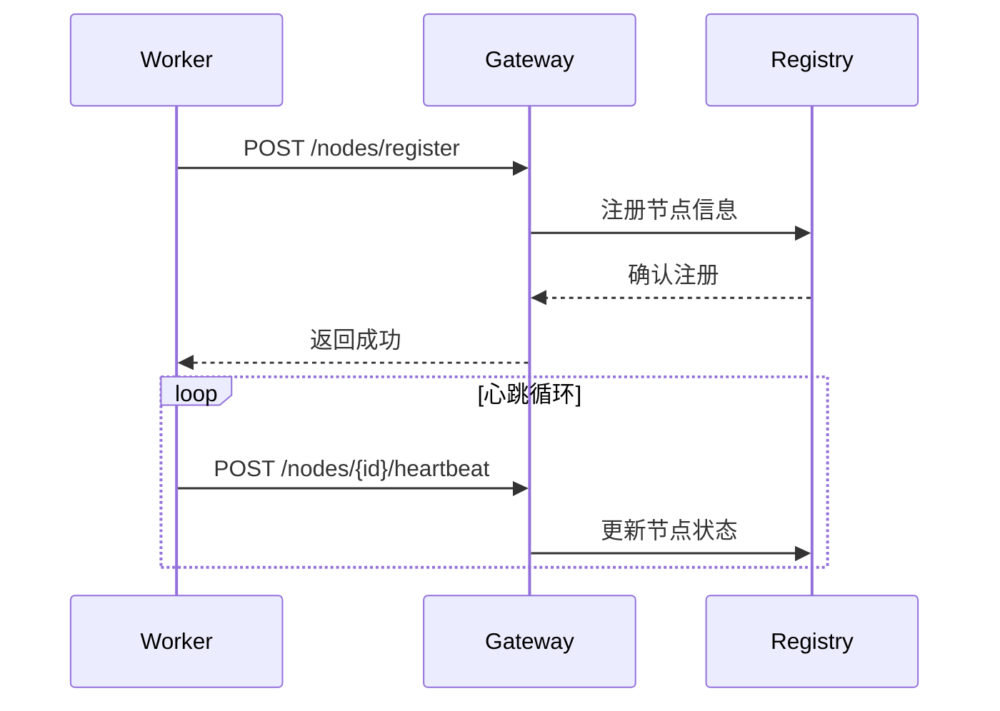

# Voice Clone TTS 架构文档

本文档详细介绍 Voice Clone TTS 的系统架构设计。

## 目录

1. [系统概览](#系统概览)
2. [架构图](#架构图)
3. [核心组件](#核心组件)
4. [数据流](#数据流)
5. [技术选型](#技术选型)
6. [扩展性设计](#扩展性设计)

---

## 系统概览

Voice Clone TTS 是一个支持多引擎的语音克隆系统，提供两种运行模式:

1. **单机模式 (v2)**: 适合个人使用和开发测试
2. **微服务模式 (v3)**: 适合生产环境和分布式部署

### 设计原则

- **引擎无关**: 统一抽象层支持多个 TTS 引擎
- **可扩展**: 易于添加新引擎和功能
- **高可用**: 微服务架构支持水平扩展
- **易集成**: 提供 CLI、HTTP API、Python 库多种接入方式

---

## 架构图

### 单机模式架构

```
┌─────────────────────────────────────────────────────────────────┐
│                         客户端层                                 │
├─────────────────────────────────────────────────────────────────┤
│   CLI (main.py)    │   HTTP API (server.py)   │   Python SDK    │
└────────┬───────────┴────────────┬─────────────┴────────┬────────┘
         │                        │                      │
         └────────────────────────┼──────────────────────┘
                                  │
         ┌────────────────────────▼───────────────────────┐
         │              VoiceClonerBase (抽象层)           │
         │  extract_voice() │ synthesize() │ load_model() │
         └────────────────────────┬───────────────────────┘
                                  │
    ┌─────────────────────────────┼─────────────────────────────┐
    │                             │                             │
┌───▼────┐                  ┌─────▼────┐                  ┌─────▼────┐
│  XTTS  │                  │ OpenVoice │                  │GPT-SoVITS│
│ Cloner │                  │  Cloner   │                  │  Cloner  │
└───┬────┘                  └─────┬────┘                  └─────┬────┘
    │                             │                             │
┌───▼─────────────────────────────▼─────────────────────────────▼───┐
│                           模型层                                   │
├───────────────────────────────────────────────────────────────────┤
│   XTTS-v2 Model   │   OpenVoice Model   │   GPT-SoVITS Model      │
│   (~2GB)          │   (~130MB)          │   (需外部 API)          │
└───────────────────────────────────────────────────────────────────┘
```

### 微服务模式架构 (v3)

```
┌─────────────────────────────────────────────────────────────────────┐
│                           客户端                                     │
│         Web App  │  Mobile App  │  第三方系统  │  CLI                │
└─────────────────────────────┬───────────────────────────────────────┘
                              │ HTTP/WebSocket
                              ▼
┌─────────────────────────────────────────────────────────────────────┐
│                      API 网关 (Gateway)                              │
│  ┌──────────────────────────────────────────────────────────────┐   │
│  │  请求路由  │  负载均衡  │  健康检查  │  流量控制  │ WebSocket │   │
│  └──────────────────────────────────────────────────────────────┘   │
│  ┌──────────────────────────────────────────────────────────────┐   │
│  │                   服务注册中心 (Registry)                     │   │
│  │         节点发现  │  心跳检测  │  状态管理  │  公告系统        │   │
│  └──────────────────────────────────────────────────────────────┘   │
└─────────────────────────────┬───────────────────────────────────────┘
                              │
        ┌─────────────────────┼─────────────────────┐
        │                     │                     │
        ▼                     ▼                     ▼
┌───────────────┐     ┌───────────────┐     ┌───────────────┐
│ XTTS Worker   │     │ XTTS Worker   │     │OpenVoice Worker│
│   Node 1      │     │   Node 2      │     │   Node 1      │
│ ┌───────────┐ │     │ ┌───────────┐ │     │ ┌───────────┐ │
│ │ XTTS-v2   │ │     │ │ XTTS-v2   │ │     │ │ OpenVoice │ │
│ │  Model    │ │     │ │  Model    │ │     │ │  Model    │ │
│ └───────────┘ │     │ └───────────┘ │     │ └───────────┘ │
│   GPU: 0      │     │   GPU: 1      │     │   CPU         │
└───────────────┘     └───────────────┘     └───────────────┘
```

---

## 核心组件

### 1. 抽象层 (VoiceClonerBase)

所有引擎的统一接口:

```python
class VoiceClonerBase(ABC):
    @abstractmethod
    def load_model(self) -> None:
        """加载 TTS 模型"""
        pass

    @abstractmethod
    def extract_voice(
        self,
        audio_path: str,
        voice_id: str,
        voice_name: str = ""
    ) -> VoiceEmbedding:
        """从参考音频提取音色特征"""
        pass

    @abstractmethod
    def synthesize(
        self,
        text: str,
        voice: VoiceEmbedding,
        output_path: str,
        language: str = "zh"
    ) -> str:
        """使用音色合成语音"""
        pass
```

### 2. 音色数据结构

```python
@dataclass
class VoiceEmbedding:
    voice_id: str           # 唯一标识
    name: str               # 显示名称
    engine: str             # 引擎类型
    embedding_path: str     # 嵌入文件路径
    created_at: float       # 创建时间
    metadata: dict          # 扩展元数据
```

### 3. 网关组件 (v3)

```
Gateway
├── Router          # 请求路由
├── LoadBalancer    # 负载均衡
├── Registry        # 服务注册
├── HealthChecker   # 健康检查
└── WebSocketHub    # 实时推送
```

### 4. 工作节点 (v3)

```
Worker
├── BaseWorker      # 基类 (生命周期、心跳、API)
├── XTTSWorker      # XTTS 实现
├── OpenVoiceWorker # OpenVoice 实现
└── SoVITSWorker    # GPT-SoVITS 实现
```

---

## 数据流

### 语音克隆流程



### 语音合成流程



### 节点注册流程



---

## 技术选型

### 框架和库

| 组件 | 技术 | 说明 |
|------|------|------|
| HTTP 框架 | FastAPI | 高性能异步 API |
| ASGI 服务器 | Uvicorn | 生产级 ASGI |
| 深度学习 | PyTorch | GPU 加速 |
| TTS 引擎 | Coqui TTS | XTTS-v2 实现 |
| 音频处理 | torchaudio | 音频 I/O |
| 数据验证 | Pydantic | 类型安全 |

### TTS 引擎对比

| 特性 | XTTS-v2 | OpenVoice | GPT-SoVITS |
|------|---------|-----------|------------|
| 多语言 | 16+ 种 | 英/中 | 中/英/日 |
| 克隆质量 | 良好 | 优秀 | 最佳 |
| 速度 | 中等 | 快 | 慢 |
| 模型大小 | 2GB | 130MB | 1GB+ |
| 部署难度 | 简单 | 中等 | 复杂 |
| 推荐场景 | 通用 | 快速部署 | 高质量 |

---

## 扩展性设计

### 添加新引擎

1. 创建引擎实现类:

```python
# my_engine/cloner.py
from common.base import VoiceClonerBase, VoiceEmbedding

class MyEngineCloner(VoiceClonerBase):
    def load_model(self):
        # 加载模型
        pass

    def extract_voice(self, audio_path, voice_id, voice_name=""):
        # 提取音色
        return VoiceEmbedding(...)

    def synthesize(self, text, voice, output_path, language="zh"):
        # 合成语音
        return output_path
```

2. 注册引擎:

```python
# engines/__init__.py
ENGINES = {
    "xtts": XTTSCloner,
    "openvoice": OpenVoiceCloner,
    "my_engine": MyEngineCloner,  # 新增
}
```

### 添加新工作节点

1. 创建 Worker 实现:

```python
# v3/workers/my_engine_worker.py
from ..workers.base_worker import BaseWorker
from ..common.models import EngineType

class MyEngineWorker(BaseWorker):
    def __init__(self, ...):
        super().__init__(
            engine_type=EngineType.MY_ENGINE,
            ...
        )

    async def load_model(self):
        # 异步加载模型
        pass

    async def synthesize(self, text, voice_id, language, **kwargs):
        # 异步合成
        pass

    async def extract_voice(self, audio_data, voice_id, voice_name, **kwargs):
        # 异步提取音色
        pass
```

### 水平扩展

微服务模式支持动态扩展:

```bash
# 启动多个相同引擎的工作节点
python -m v3.main worker --engine xtts --port 8001 --gateway http://gateway:8080
python -m v3.main worker --engine xtts --port 8002 --gateway http://gateway:8080
python -m v3.main worker --engine xtts --port 8003 --gateway http://gateway:8080
```

网关会自动发现并负载均衡到所有节点。

---

## 目录结构

```
voice-clone-tts/
├── production/              # v2 单机模式
│   ├── main.py             # CLI 入口
│   ├── server.py           # HTTP 服务器
│   ├── client.py           # Python 客户端
│   ├── common/             # 公共模块
│   │   └── base.py         # 抽象基类
│   └── xtts/               # XTTS 引擎
│       └── cloner.py
│
├── v3/                      # v3 微服务模式
│   ├── main.py             # 入口
│   ├── common/             # 公共模块
│   │   ├── models.py       # 数据模型
│   │   └── exceptions.py   # 异常类
│   ├── gateway/            # 网关
│   │   ├── server.py       # 网关服务
│   │   ├── router.py       # 路由
│   │   ├── registry.py     # 服务注册
│   │   └── websocket.py    # WebSocket
│   └── workers/            # 工作节点
│       ├── base_worker.py  # 基类
│       └── xtts_worker.py  # XTTS 实现
│
├── voices/                  # 音色存储
├── docs/                    # 文档
└── packages/                # 组件包
    ├── models/             # 模型文件
    ├── tools/              # 工具软件
    └── dependencies/       # 依赖包
```

---

## 下一步

- [集成指南](INTEGRATION.md) - 集成到你的项目
- [API 参考](api/README.md) - 完整 API 文档
- [部署指南](DEPLOYMENT.md) - 生产环境部署
