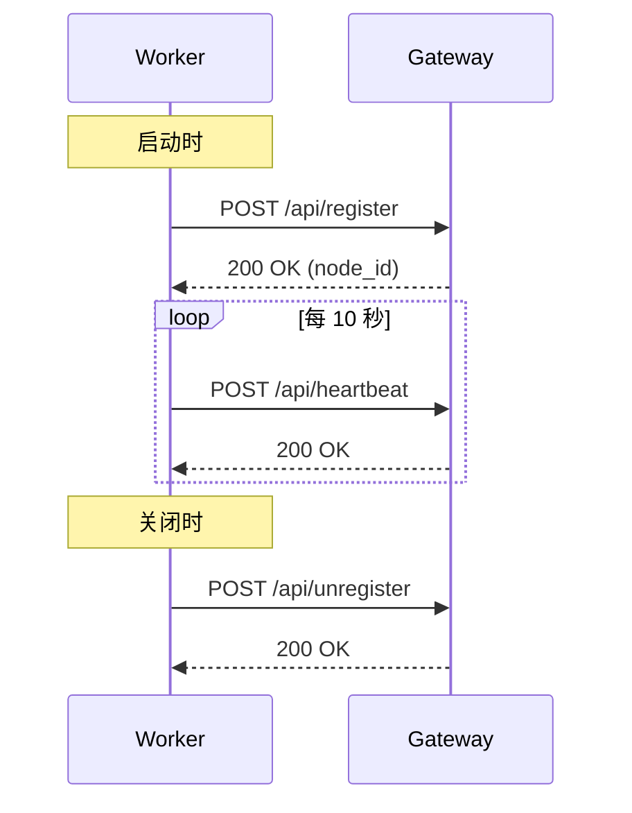
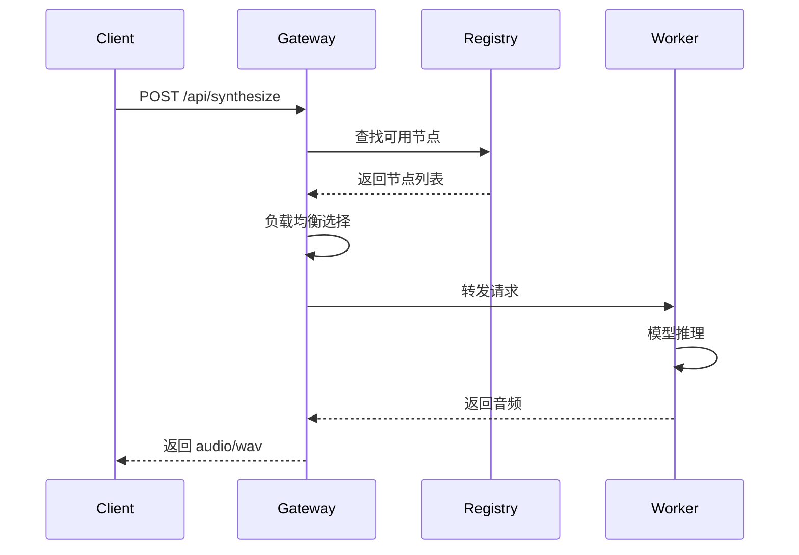

# Voice Clone TTS 架构文档

> v3.1 微服务架构 | 更新日期: 2025-11-30

## 系统架构

### 整体架构图

```
┌──────────────────────────────────────────────────────────────────┐
│                         Clients                                   │
│   (Web Browser / curl / Python Client / Mobile App)              │
└──────────────────────────────┬───────────────────────────────────┘
                               │
                               ▼
┌──────────────────────────────────────────────────────────────────┐
│                      Gateway (FastAPI)                            │
│                         Port: 8080                                │
│  ┌────────────┐  ┌────────────┐  ┌────────────┐  ┌────────────┐  │
│  │  路由分发   │  │  限流控制   │  │  服务注册   │  │  WebSocket │  │
│  │  Router    │  │  Limiter   │  │  Registry  │  │  实时状态   │  │
│  └────────────┘  └────────────┘  └────────────┘  └────────────┘  │
└──────────────────────────────┬───────────────────────────────────┘
                               │
          ┌────────────────────┼────────────────────┐
          │                    │                    │
          ▼                    ▼                    ▼
┌─────────────────┐  ┌─────────────────┐  ┌─────────────────┐
│   XTTS Worker   │  │ OpenVoice Worker│  │ GPT-SoVITS      │
│   Port: 8001    │  │   Port: 8002    │  │ Worker :8003    │
│  ┌───────────┐  │  │  ┌───────────┐  │  │  ┌───────────┐  │
│  │ XTTS-v2   │  │  │  │ OpenVoice │  │  │  │ API Proxy │  │
│  │  Model    │  │  │  │   Model   │  │  │  │ → :9880   │  │
│  └───────────┘  │  │  └───────────┘  │  │  └───────────┘  │
└─────────────────┘  └─────────────────┘  └─────────────────┘
```

### 组件说明

| 组件 | 职责 | 技术栈 |
|------|------|--------|
| Gateway | 请求路由、负载均衡、限流、服务发现 | FastAPI, uvicorn |
| XTTS Worker | XTTS-v2 模型推理 | TTS 0.22.0, PyTorch |
| OpenVoice Worker | OpenVoice 音色转换 | edge-tts, PyTorch |
| GPT-SoVITS Worker | GPT-SoVITS API 代理 | httpx |

---

## 目录结构

```
github004/
├── voice-clone-tts/              # 主项目
│   ├── src/                      # 源代码
│   │   ├── __init__.py
│   │   ├── main.py               # 入口文件（CLI）
│   │   ├── common/               # 公共模块
│   │   │   ├── __init__.py
│   │   │   ├── models.py         # Pydantic 数据模型
│   │   │   ├── paths.py          # 路径配置
│   │   │   ├── exceptions.py     # 自定义异常
│   │   │   └── logging.py        # 日志配置
│   │   ├── gateway/              # 网关模块
│   │   │   ├── __init__.py
│   │   │   ├── app.py            # FastAPI 应用
│   │   │   ├── registry.py       # 服务注册中心
│   │   │   ├── limiter.py        # 限流器
│   │   │   └── websocket.py      # WebSocket 管理
│   │   └── workers/              # 工作节点
│   │       ├── __init__.py
│   │       ├── base_worker.py    # 工作节点基类
│   │       ├── xtts_worker.py    # XTTS-v2 实现
│   │       ├── openvoice_worker.py
│   │       └── gpt_sovits_worker.py
│   ├── voices/                   # 音色存储目录
│   ├── logs/                     # 日志目录
│   ├── config.yaml               # 配置文件
│   ├── requirements.txt          # Python 依赖
│   ├── Dockerfile                # Docker 镜像
│   └── docker-compose.yml        # Docker Compose
│
├── packages/                     # 组件包
│   ├── models/                   # 模型文件
│   │   ├── xtts_v2/              # XTTS-v2 (~2GB)
│   │   ├── openvoice/            # OpenVoice (~126MB)
│   │   └── whisper/              # Whisper (~1.5GB)
│   ├── tools/                    # 工具软件
│   │   └── ffmpeg/               # FFmpeg (~551MB)
│   └── repos/                    # 开源仓库
│       └── GPT-SoVITS/           # (需手动克隆)
│
├── tests/                        # 测试套件
│   ├── conftest.py               # pytest 配置
│   ├── test_models.py            # 数据模型测试
│   ├── test_paths.py             # 路径配置测试
│   ├── test_gateway.py           # 网关测试
│   ├── test_worker.py            # 工作节点测试
│   └── test_api.py               # API 集成测试
│
├── docs/                         # 文档
│   ├── ARCHITECTURE.md           # 本文档
│   ├── INSTALLATION_GUIDE.md     # 安装指南
│   ├── CHANGELOG.md              # 版本历史
│   └── ...
│
├── test_audio/                   # 测试音频
├── CLAUDE.md                     # Claude Code 指南
└── .gitignore
```

---

## 服务通信

### 服务注册流程



### 请求处理流程



---

## 数据模型

### 核心模型 (common/models.py)

```python
class SynthesizeRequest(BaseModel):
    """语音合成请求"""
    text: str                    # 要合成的文本
    voice_id: str               # 音色 ID
    language: str = "zh"        # 语言代码
    speed: float = 1.0          # 语速

class VoiceInfo(BaseModel):
    """音色信息"""
    voice_id: str               # 音色 ID
    name: str                   # 显示名称
    engine: str                 # 引擎类型
    created_at: datetime        # 创建时间

class NodeInfo(BaseModel):
    """工作节点信息"""
    node_id: str                # 节点 ID
    engine: str                 # 引擎类型
    host: str                   # 主机地址
    port: int                   # 端口
    status: WorkerStatus        # 状态
    current_load: int           # 当前负载
    max_concurrent: int         # 最大并发
```

---

## 限流策略

### 多层限流

| 层级 | 配置 | 说明 |
|------|------|------|
| 全局 | 1000 RPM | 系统总请求限制 |
| IP | 100 RPM | 单 IP 请求限制 |
| 并发 | 50 | 最大同时处理请求数 |

### 限流响应

```json
{
  "error": "rate_limit_exceeded",
  "message": "Too many requests",
  "retry_after": 60
}
```

---

## 部署方式

### 1. 单机模式 (开发/测试)

```bash
python -m src.main standalone --engine xtts --port 8080
```

### 2. 分布式模式 (生产)

```bash
# Gateway
python -m src.main gateway --port 8080

# Workers
python -m src.main worker --engine xtts --port 8001 --gateway http://localhost:8080
python -m src.main worker --engine openvoice --port 8002 --gateway http://localhost:8080
```

### 3. Docker Compose

```bash
docker-compose up -d gateway xtts-worker
```

---

## 引擎对比

| 引擎 | 音色提取 | 中文质量 | 参考音频 | 推荐场景 |
|------|---------|---------|---------|---------|
| **XTTS-v2** | ✅ | ⭐⭐⭐ | 6秒 | 多语言克隆 |
| **OpenVoice** | ✅ | ⭐⭐⭐⭐ | 3-10秒 | 音色转换 |
| **GPT-SoVITS** | ✅ | ⭐⭐⭐⭐⭐ | 5秒 | 中文首选 |

---

## 配置文件

### config.yaml 结构

```yaml
gateway:
  host: "0.0.0.0"
  port: 8080
  global_rpm: 1000      # 全局请求限制
  ip_rpm: 100           # 单 IP 限制
  concurrent_limit: 50  # 并发限制
  heartbeat_interval: 10
  dead_threshold: 30

workers:
  xtts:
    port: 8001
    model_path: ""      # 留空则使用默认路径
    device: "cuda"
  openvoice:
    port: 8002
    model_path: ""
    device: "cuda"
  gpt_sovits:
    port: 8003
    api_url: "http://127.0.0.1:9880"

logging:
  level: "INFO"
  format: "%(asctime)s - %(name)s - %(levelname)s - %(message)s"
  file: "logs/voice-clone.log"

paths:
  voices: "voices"
  output: "output"
  temp: "temp"
```

---

## 监控与日志

### 健康检查

```bash
# Gateway 健康检查
curl http://localhost:8080/health

# Worker 健康检查
curl http://localhost:8001/health
```

### 日志位置

- Gateway: `logs/gateway.log`
- Worker: `logs/worker-{engine}.log`

### WebSocket 实时状态

```javascript
const ws = new WebSocket('ws://localhost:8080/ws');
ws.onmessage = (event) => {
  const status = JSON.parse(event.data);
  console.log('Nodes:', status.nodes);
};
```

---

## 安全考虑

1. **限流保护** - 防止 DDoS 攻击
2. **输入验证** - Pydantic 模型验证
3. **音频格式检查** - 仅接受 WAV/MP3
4. **文件大小限制** - 最大 50MB
5. **CORS 配置** - 可配置允许的源

---

## 版本历史

### v3.1 (2025-11-30)
- 添加优雅关闭机制
- 改进信号处理
- 更新文档和配置

### v3.0 (2025-11-29)
- 微服务架构重构
- 服务注册与发现
- WebSocket 实时状态
- 多层限流系统

---

## 相关文档

- [安装指南](INSTALLATION_GUIDE.md)
- [API 文档](http://localhost:8080/docs)
- [变更日志](CHANGELOG.md)
