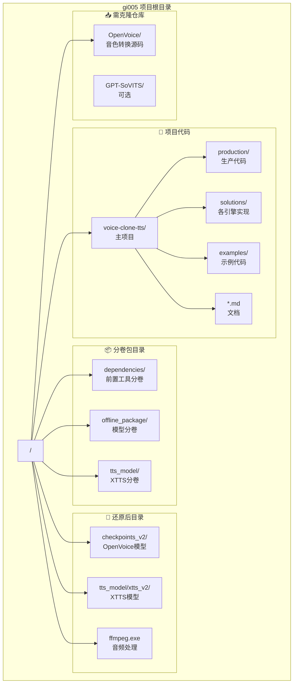
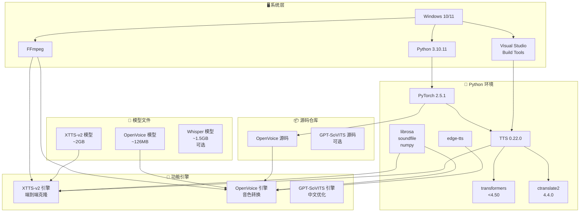
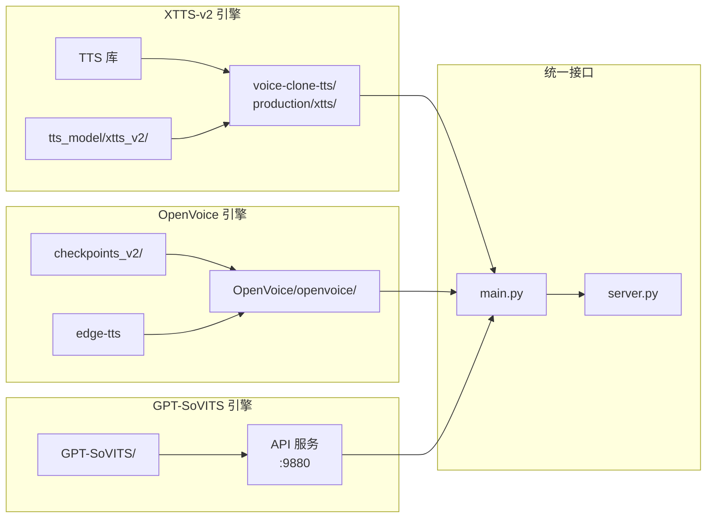
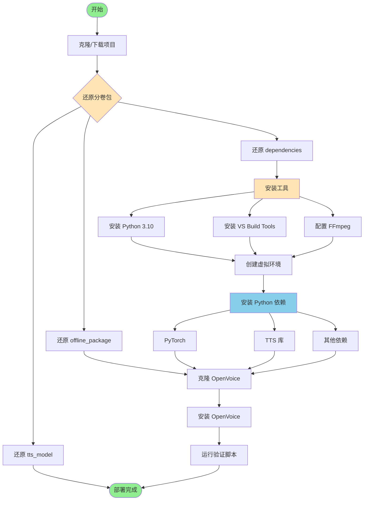
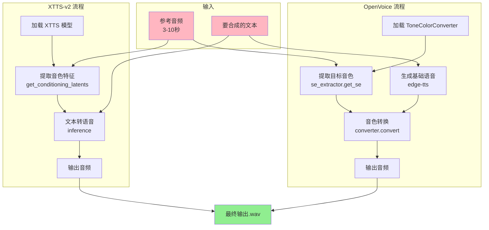
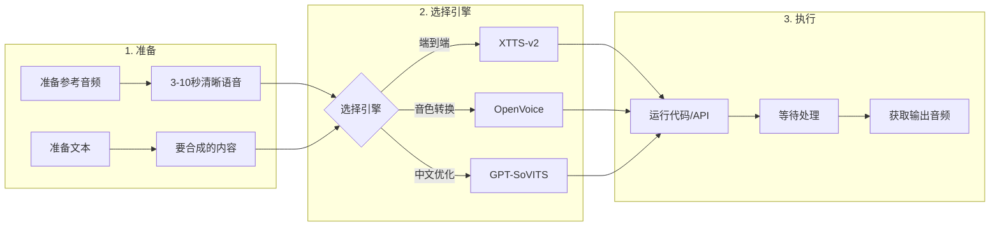
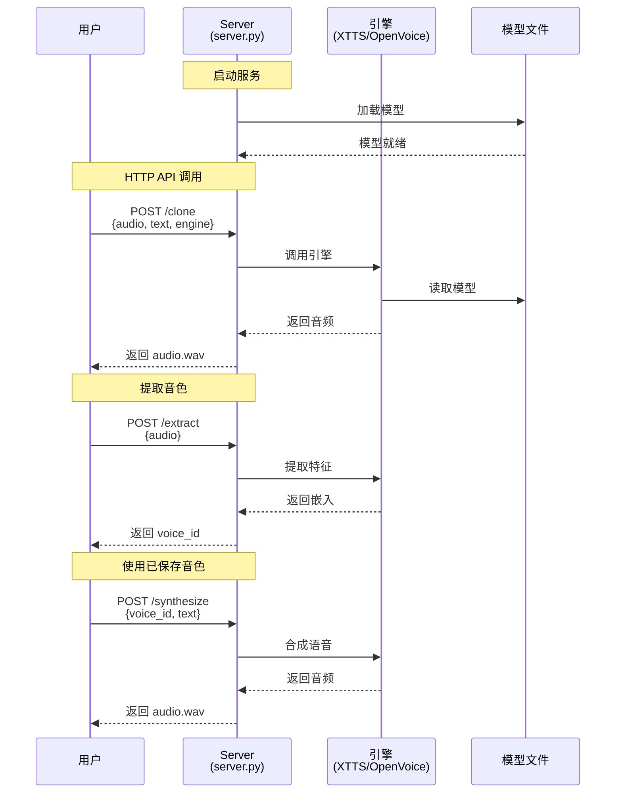
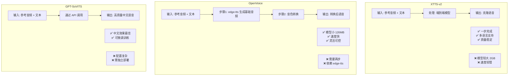
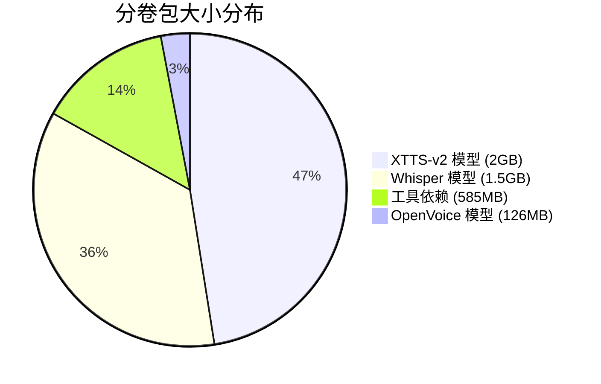

# 🏗️ 项目架构与导航

本文档提供项目整体架构、依赖关系和使用流程的可视化说明。

---

## 📚 文档导航

按以下顺序阅读文档：

| 序号 | 文档 | 说明 | 适合人群 |
|------|------|------|----------|
| 1 | [OFFLINE_QUICKSTART.md](./OFFLINE_QUICKSTART.md) | 🎯 傻瓜式完整部署指南 | **新手必读** |
| 2 | [EXTERNAL_REPOS_SETUP.md](./EXTERNAL_REPOS_SETUP.md) | 外部仓库克隆配置 | 所有用户 |
| 3 | [COMPLETE_REPRODUCTION_GUIDE.md](./COMPLETE_REPRODUCTION_GUIDE.md) | 详细复现指南 | 进阶用户 |
| 4 | [VERIFICATION_REPORT.md](./VERIFICATION_REPORT.md) | 验证报告与问题排查 | 遇到问题时 |
| 5 | [PROJECT_SUMMARY.md](./PROJECT_SUMMARY.md) | 项目总结 | 了解全貌 |
| 6 | **本文档** | 架构图与流程图 | 理解原理 |

### 其他重要文件

| 目录/文件 | 说明 |
|-----------|------|
| [../dependencies/README.md](../dependencies/README.md) | 前置工具依赖包 |
| [../offline_package/README.md](../offline_package/README.md) | OpenVoice/Whisper 模型 |
| [../tts_model/README.md](../tts_model/README.md) | XTTS-v2 模型 |

---

## 🗂️ 项目目录结构



### 详细目录树

```
gi005/
├── 📦 dependencies/              # 前置工具分卷包
│   ├── README.md
│   └── tools.pkg.part_*         # 7个分卷 (~585MB)
│
├── 📦 offline_package/           # 模型分卷包
│   ├── README.md
│   ├── checkpoints_v2.pkg.part_* # 2个分卷 (~126MB)
│   └── whisper_models.pkg.part_* # 16个分卷 (~1.5GB)
│
├── 📦 tts_model/                 # XTTS 模型分卷包
│   ├── README.md
│   └── xtts_v2_full.pkg.part_*  # 21个分卷 (~2GB)
│
├── 📝 voice-clone-tts/           # 主项目代码
│   ├── production/              # 生产环境代码
│   │   ├── main.py             # 命令行入口
│   │   ├── server.py           # HTTP API 服务
│   │   ├── client.py           # 客户端
│   │   ├── common/             # 公共模块
│   │   └── xtts/               # XTTS 引擎
│   │
│   ├── solutions/               # 各引擎独立实现
│   │   ├── 01-openvoice/
│   │   ├── 02-coqui-xtts/
│   │   ├── 03-gpt-sovits/
│   │   ├── 04-cosyvoice/
│   │   └── 05-fish-speech/
│   │
│   ├── examples/                # 示例代码
│   │
│   └── *.md                     # 文档文件
│
├── 🔧 checkpoints_v2/            # [还原后] OpenVoice 模型
│   ├── converter/
│   │   ├── config.json
│   │   └── checkpoint.pth
│   └── base_speakers/ses/
│       ├── en-us.pth
│       └── zh.pth
│
├── 🔧 tts_model/xtts_v2/         # [还原后] XTTS 模型
│   ├── config.json
│   ├── model.pth
│   ├── dvae.pth
│   ├── vocab.json
│   └── speakers_xtts.pth
│
├── 📥 OpenVoice/                 # [克隆] OpenVoice 源码
│   ├── openvoice/
│   │   ├── api.py
│   │   └── se_extractor.py
│   └── setup.py
│
├── 🔧 ffmpeg.exe                 # [还原后] 音频处理
├── 🔧 ffprobe.exe
├── 🔧 ffplay.exe
│
├── 🐍 venv/                      # Python 虚拟环境
│
├── .gitignore
├── CLAUDE.md
└── README.md
```

---

## 🔗 依赖关系图

### 整体依赖架构



### 模型与代码依赖



---

## 🔄 运行流程

### 安装部署流程



### 音色克隆执行流程



---

## 🎮 使用流程

### 快速使用流程



### API 服务使用流程



---

## 🧩 引擎对比



---

## 📊 文件大小统计



| 分类 | 文件 | 大小 | 分卷数 |
|------|------|------|--------|
| 模型 | tts_model/xtts_v2_full.pkg.part_* | ~2GB | 21 |
| 模型 | offline_package/whisper_models.pkg.part_* | ~1.5GB | 16 |
| 模型 | offline_package/checkpoints_v2.pkg.part_* | ~126MB | 2 |
| 工具 | dependencies/tools.pkg.part_* | ~585MB | 7 |
| **总计** | | **~4.2GB** | **46** |

---

## 🚀 快速命令参考

### 部署命令速查

```bash
# 1. 克隆项目
git clone https://github.com/githubstudycloud/gi005.git
cd gi005

# 2. 还原分卷包 (Windows CMD)
cd dependencies && copy /b tools.pkg.part_* tools.tar && tar -xvf tools.tar && cd ..
cd offline_package && copy /b checkpoints_v2.pkg.part_* cp.tar && tar -xvf cp.tar && move checkpoints_v2 ..\ && cd ..
cd tts_model && copy /b xtts_v2_full.pkg.part_* xtts.tar && tar -xvf xtts.tar && cd ..

# 3. 创建环境
python -m venv venv
venv\Scripts\activate

# 4. 安装依赖
pip install torch==2.5.1 torchaudio==2.5.1 --index-url https://download.pytorch.org/whl/cpu
pip install TTS==0.22.0 "transformers<4.50" ctranslate2==4.4.0 edge-tts

# 5. 克隆 OpenVoice
git clone https://github.com/myshell-ai/OpenVoice.git
cd OpenVoice && pip install -e . && cd ..

# 6. 验证
python test_setup.py
```

### 使用命令速查

```bash
# 启动 API 服务
python voice-clone-tts/production/server.py --engine xtts --port 8000

# 命令行使用
python voice-clone-tts/production/main.py clone \
    --engine openvoice \
    --reference voice.wav \
    --text "要合成的文本" \
    --output output.wav
```

---

## 📞 问题反馈

- GitHub Issues: https://github.com/githubstudycloud/gi005/issues
- 查看 [VERIFICATION_REPORT.md](./VERIFICATION_REPORT.md) 了解已知问题

---

*文档版本: 1.0 | 更新日期: 2025-11-28*
